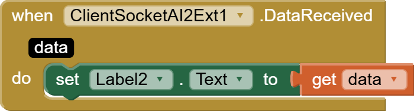
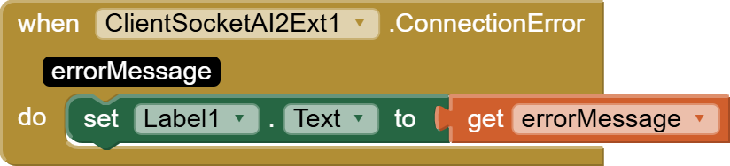

# ClientSocketAI2Ext-v5

ClientSocketAI2Ext - bu MIT App Inventor uchun yozilgan kengaytma (extension) bo'lib, Android ilovalarida TCP socket orqali server bilan aloqa qilish imkonini beradi. Ushbu komponent orqali siz serverga ulanish, ma'lumot yuborish va qabul qilish mumkin.

## Xususiyatlar

- **ServerAddress**: Serverning IP manzili yoki host nomi.
- **ServerPort**: Serverning port raqami.
- **ConnectionState**: Ulanish holati (`true` - ulangan, `false` - ulanmagan).
- **HexaStringMode**: Ma'lumotlarni hexadecimal (16-lik sanoq sistemasida) yuborish va qabul qilish rejimi.
- **DebugMessages**: Xatoliklarni ko'rsatish yoki yashirish rejimi.

## Metodlar

- **Connect()**: Serverga ulanish uchun ishlatiladi.
- **SendData(String data)**: Serverga ma'lumot yuborish uchun ishlatiladi.
- **Disconnect()**: Server bilan aloqani uzish uchun ishlatiladi.

## Hodisalar

- **DataReceived(String data)**: Serverdan ma'lumot qabul qilinganda ishga tushadi.
- **RemoteConnectionClosed()**: Server aloqani uzganida ishga tushadi.
- **ConnectionError(String errorMessage)**: Ulanishda xatolik yuzaga kelsa ishga tushadi.

## Foydalanish Misoli

1. **ServerAddress** va **ServerPort** xususiyatlarini sozlang.
2. **Connect()** metodini chaqirib serverga ulaning.
3. **SendData()** metodidan foydalanib serverga ma'lumot yuboring.
4. **DataReceived** hodisasidan foydalanib serverdan kelgan ma'lumotlarni qabul qiling.
5. **Disconnect()** metodini chaqirib aloqani uzish.

### App Inventor Bloklari

#### DataReceived Hodisasi

#### ConnectionError Hodisasi

